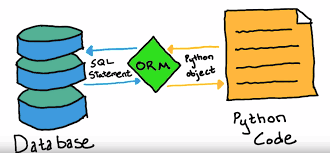

# nodejs-basic-bnmd
First nodejs basic repo.

## Content of the course

- [nodejs-basic-bnmd](#nodejs-basic-bnmd)
  - [Content of the course](#content-of-the-course)
  - [Lesson 01: What is Node.js? (V8 Engine)](#lesson-01-what-is-nodejs-v8-engine)
  - [Lesson 02: Setup Environment (IDE/Node.js)](#lesson-02-setup-environment-idenodejs)
  - [Lesson 03: Clients/Servers | Request/Response](#lesson-03-clientsservers--requestresponse)
  - [Lesson 04: NPM (Node package manager)](#lesson-04-npm-node-package-manager)
  - [Lesson 05: Express App (Hello world)](#lesson-05-express-app-hello-world)
  - [Lesson 06: View Engines](#lesson-06-view-engines)
  - [Lesson 07: Static Files](#lesson-07-static-files)
  - [Lesson 08: Routers \& MVC](#lesson-08-routers--mvc)
  - [Lesson 09: HTTP Request Method \& Database](#lesson-09-http-request-method--database)
  - [Lesson 10: Create NAV bar \& EJS Loop Data](#lesson-10-create-nav-bar--ejs-loop-data)
    - [Discussion](#discussion)
  - [Lesson 11: Form / Route Parameters](#lesson-11-form--route-parameters)
    - [Discussion](#discussion-1)
  - [Lesson 12: POST Method](#lesson-12-post-method)
  - [Lesson 13: CRUD](#lesson-13-crud)
  - [Lesson 14: Rest API](#lesson-14-rest-api)
  - [Lesson 15: Upload Files](#lesson-15-upload-files)
  - [Lesson 16: Middlewware](#lesson-16-middlewware)
  - [Lesson 17: what next](#lesson-17-what-next)

## Lesson 01: What is Node.js? (V8 Engine)

## Lesson 02: Setup Environment (IDE/Node.js)

VSCode 
Install node (use nvm to manage node version )

## Lesson 03: Clients/Servers | Request/Response

## Lesson 04: NPM (Node package manager)

Some command to use

    npm install --save-exact express@4.17.1
    npm install --save-exact ejs@3.1.6
    npm install --save-exact body-parser@1.19.0
    npm install --save-exact nodemon@2.0.12
    npm install --save-exact @babel/core@7.15.5
    npm install --save-exact @babel/node@7.15.4 @babel/preset-env@7.15.6
    npm install --save-exact dotenv@10.0.0
    npm version 
    git checkout dev 
    git commit -m "comment"
    git push origin dev 

## Lesson 05: Express App (Hello world)

Hello world example [link](http://expressjs.com/en/starter/hello-world.html)

## Lesson 06: View Engines

Template Engine [link](http://expressjs.com/en/resources/template-engines.html)
EJS Engine

## Lesson 07: Static Files 

Static files [link](http://expressjs.com/en/starter/static-files.html)

## Lesson 08: Routers & MVC

MVC Design pattern : Model View Controller

ORM : Object Relational Mapping

## Lesson 09: HTTP Request Method & Database

Express JS : Basic routing [link](http://expressjs.com/en/starter/basic-routing.html)
HTTP Request methods [link](https://en.wikipedia.org/wiki/HTTP#Request_methods)
CRUD: Create/ Read/ Update/ Delete [link](https://vi.wikipedia.org/wiki/CRUD)
- Equivalent Method of : POST/GET/PUT/DELETE

MongoDB: Chat real time, store video
- data as Object (only GET method is enough)
- MongoDB use ORM
- Slow when join table
- Raw query: select * from users, but ORM: findALL()

eCommerce: SQL, postGres, Oracle (finance, stock)

mysql2 versus mysql [link](https://www.google.com/url?sa=t&rct=j&q=&esrc=s&source=web&cd=&cad=rja&uact=8&ved=2ahUKEwj-w-maie__AhVatlYBHaNsAdMQFnoECA4QAQ&url=https%3A%2F%2Fstackoverflow.com%2Fquestions%2F25344661%2Fwhat-is-the-difference-between-mysql-mysql2-considering-nodejs&usg=AOvVaw2yyP0kcoAiAuV_dNPREENF&opi=89978449)

`npm install --save-exact mysql2@2.3.0`

XAMPP installation [link](https://www.apachefriends.org/download_success.html)

## Lesson 10: Create NAV bar & EJS Loop Data

Nav Bar template [link](https://www.w3schools.com/howto/howto_js_topnav.asp)
EJS Loop [link](https://stackoverflow.com/questions/22952044/loop-through-json-in-ejs)

### Discussion

* mấy bác nhớ run lại cái Xampp nhé. chứ chạy npm start ko sẽ báo lỗi events error 498, làm mình mò mãi :v
* Dự định sắp tới a có ra Typescript hay NextJS hông anh
* - hiện tại a chưa có e nhé. vì cộng đồng js thuần nó vẫn đông hơn typescript :v
* anh ơi có cách nào không cần lấy cái nguyên row trực tiếp mà không cần phải sử dụng data.push từng cái không anh
* anh ơi em xóa cái JSON.stringtify rồi mà nó vẫn không chuyển thanh object ạ ??
* - em console.log ra xem giá trị của biến nó như thế nào. đã đúng form object chưa
* Cái này mình dùng bootstrap làm giao diện được ko a

## Lesson 11: Form / Route Parameters

### Discussion

## Lesson 12: POST Method

## Lesson 13: CRUD

## Lesson 14: Rest API

## Lesson 15: Upload Files

## Lesson 16: Middlewware

## Lesson 17: what next
